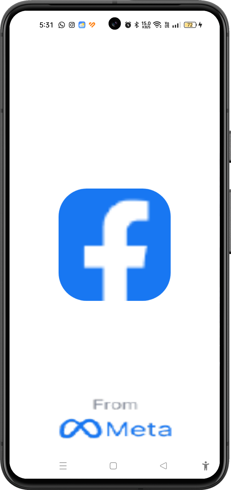
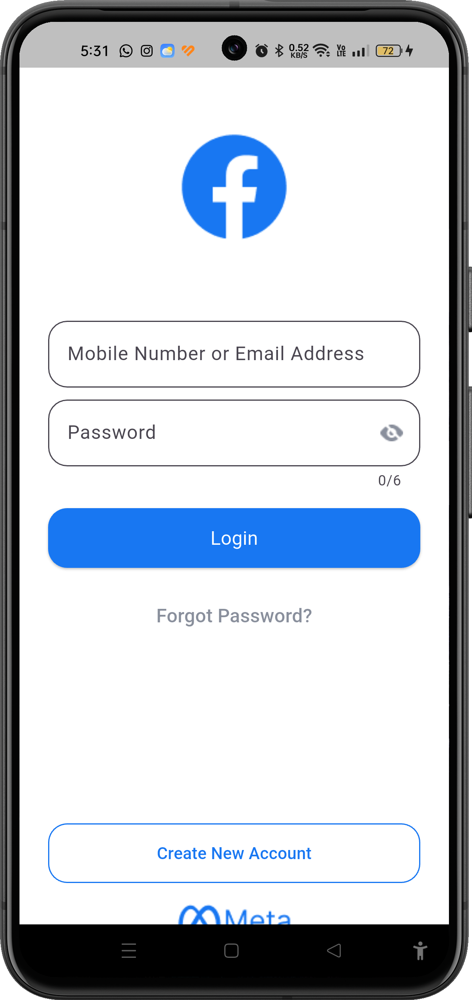
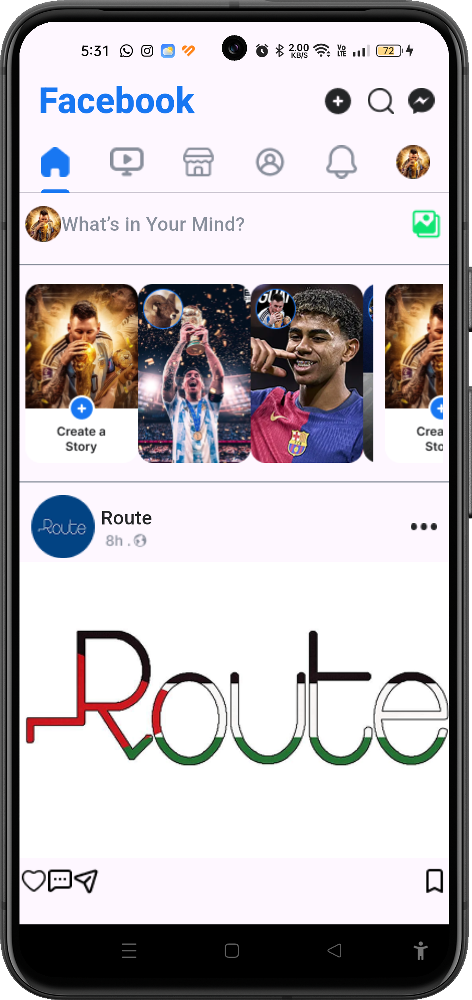

# 📱 Facebook App

A simple Facebook-like social media app built with Flutter. Users can log in, browse a news feed, view stories, and interact with posts.

---

## ✨ Features

- 🔐 **User Authentication** — Login with email and password validation
- 📰 **News Feed** — Scroll through posts from your network
- 📖 **Stories** — View horizontally scrollable stories
- ❤️ **Like Posts** — React to posts with a like
- 💬 **Comment on Posts** — Engage with post content
- 📤 **Share Posts** — Share posts with others
- 🔖 **Bookmark Posts** — Save posts for later
- 🗂️ **Tab Navigation** — Home, Videos, Marketplace, Profile, Notifications

---

## 🛠 Tech Stack

| Technology | Purpose |
|---|---|
| [Flutter](https://flutter.dev/) | Cross-platform UI framework |
| [Dart](https://dart.dev/) | Programming language |
| `flutter_native_splash` | Custom splash screen |

---

## 📸 Screenshots

<p align="center">
  
  &nbsp;&nbsp;
  
  &nbsp;&nbsp;
  
</p>

---

## ▶️ How to Run

1. **Clone the repository**
   ```bash
   git clone https://github.com/fatmanagaa/facebook_app.git
   cd facebook_app
   ```

2. **Install dependencies**
   ```bash
   flutter pub get
   ```

3. **Run the app**
   ```bash
   flutter run
   ```

---

## 📝 Notes

> This is a practice project — a simplified UI clone of Facebook built for learning Flutter. It demonstrates navigation, form validation, and UI layout without a backend.
